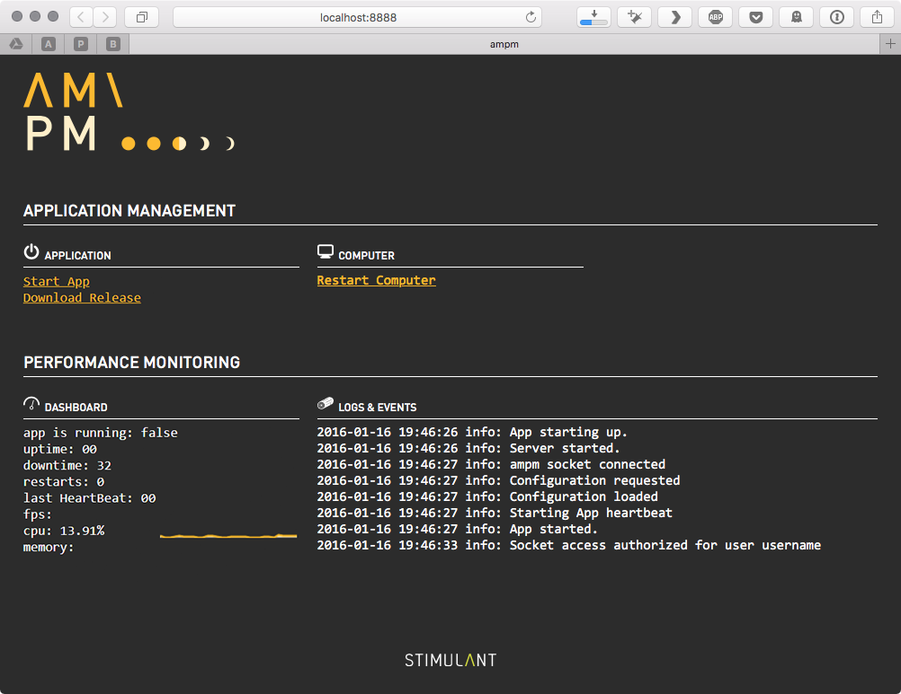

# ampm

<p align="center">
  
  <br/>
  <br/>
  <strong>application management<br/>+<br/>performance monitoring</strong>
</p>

ampm is [Stimulant's](http://stimulant.com) tool for monitoring public-facing software that needs to run 24/7. It does a bunch of things:

* Launches an application and restarts it when it crashes, leaks, or whenever you want it to.
* Provides application configuration, and applies different settings for different environments.
* Makes it easy to log troubleshooting information to a file, and email out any errors or crashes.
* Makes it easy to integrate Google Analytics with an application.
* Provides hooks for custom server-side logic and ways for multiple instances of an app to communicate.
* Provides a mobile-friendly web panel which displays app status and controls.
* Supports any application type that can speak websockets or OSC. There are [samples](https://github.com/stimulant/ampm/tree/master/samples) for [web apps](https://github.com/stimulant/ampm/tree/master/samples/web), [WPF](https://github.com/stimulant/ampm/tree/master/samples/WPF), [Cinder](https://github.com/stimulant/ampm/tree/master/samples/Cinder), [Unity](https://github.com/stimulant/ampm/tree/master/samples/Unity3D), and [Processing](https://github.com/stimulant/ampm/tree/master/samples/processing).

<p align="center">
  
</p>

## Table of Contents

* [Project Details](#project-details)
* [Installation](#installation)
* [Usage](#usage)
* [Troubleshooting](#troubleshooting)
* [Roadmap](#roadmap)
* [License](#license)
* [Notes](#notes)

---

## Project Details

### Resources


### Dependencies & Frameworks

- Nodejs

## Installation
1. Install dependencies

   1. Install [npm](https://www.npmjs.com/get-npm) (Nodejs package manager). In installation options, make sure to enable the install of Chocolatey. 

   2. Open an administrator command prompt, then install the [nodemon](http://nodemon.io) utility using the command

      ```bash
      npm install -g nodemon
      ```

   3. Install [git](https://git-scm.com/download/win) (if developing).

2. Install ampm one of two ways, depending on your use case:

   1. To use the last node build (which may not include all features in this repo), execute the command:

      ```bash
      npm install -g ampm
      ```

   2. To develop ampm and/or use all features in this repo, ampm must be installed from source:

      ```bash
      git clone http://github.com/local-projects/ampm.git
      cd ampm
      npm link
      ```

      Note: It is recommended to clone this to `C:\\localprojects\\ampm` or similar.

## Usage

After installing, the `ampm` command should be available on your system. The command only has two arguments, one for a configuration file, and one for the mode to run in. With no arguments, `ampm` will use the `ampm.json` configuration file and the default configuration within it.

To use a different configuration file or mode (explained further below), you can use:

`ampm ampm.json dev`

You can also specify multiple configuration files. The first one will be the one used, but you can then switch between them using the web console.

`ampm app1.json,app2.json,app3.json live`

If you pass arguments other than the config file and the mode, those will be passed as arguments to [nodemon](http://nodemon.io).

Note that machine restart functionality requires executing ampm with administrative privileges.

`sudo ampm ampm.json`

### Configuration

ampm requires a configuration file in order to monitor your application. Start with a file called `ampm.json`, placed somewhere near your application binary.

You can include multiple configuration schemes in the same json file. For example.

```JavaScript
{
    "default": {
        // lots of configuration
    },
    "dev": {
        // only the configuration which overrides the default
    },
    "dev.foo" {
        // only the configuration which overrides default and dev
    },
    "machinename" {
        // configuration to apply on a specific machine
    },
    "machinename.dev" {
        // configuration to apply only to a specific machine in dev
    }
}
```

You can specify which configurations to use as an argument to node:

* use the default: `ampm ampm.json`, or just `ampm`
* use the dev configuration: `ampm ampm.json dev`
* use the dev.foo configuration: `ampm ampm.json dev.foo`

You don't have to explicitly specify the usage of machine-specific configurations, that will happen automatically if the current machine name matches a configuration. 

The configuration is broken into a number of modules. You only need to specify the defaults you want to override.

#### Persistence

The persistence manager is in chage of starting a process, monitoring it, restarting it if it dies, and triggering updates on a schedule. At a minimum you'll need to set the launchCommand here in order to monitor anything.

```JavaScript
"persistence": {
    // The command to run to launch the client, relative to the config file.
    "launchCommand": "",

    // The command to run to launch a parallel process, relative to
    // the config file. {config} will be replaced with the contents of the config
    // file. This process will be stopped and started at the same time as the
    // main process.
    "sideCommand": "",

    // A command to run after the first heartbeat to do any additional
    // system configuration.
    "postLaunchCommand": "",

    // Restart the app if it doesn't start up in this much time. Set to
    // zero (default) to allow the app to take forever to start up.
    "startupTimeout": 0,

    // Restart the app this many seconds of no heartbeat messages. Set to
    // zero (default) to never restart due to lack of heartbeats.
    "heartbeatTimeout": 0,

    // Restart the machine after this many app restarts.
    "restartMachineAfter": Infinity,

    // Shut down the app on this schedule -- see cronmaker.com for the format.
    "shutdownSchedule": null,

    // Shut down the PC on this schedule -- see cronmaker.com for the format.
    "shutdownPcSchedule": null,

    // Start up the app on this schedule -- see cronmaker.com for the format.
    "startupSchedule": null,

    // Restart the app on this schedule -- see cronmaker.com for the format. 
    "restartSchedule": null,
    
    // Restart the PC on this schedule -- see cronmaker.com for the format.
    "restartPcSchedule": null,        

    // Restart the app if it uses more than this much memory.
    "maxMemory": Infinity
}
```

##### Monitoring PID

Monitoring the PID of the launch command was added and defaulted to true. To turn monitoring the PID of the launch command off, add the following to ```ampm.json``` file

```json
"persistence": {  
	// MONITOR PID 
    "monitorPID": false
}
```

*Reasons to turn monitoring PID off*

* Launch command does not have a PID to monitor. For example, the ```FLDC Conversation Booth``` needs to be started via a startup bat file due to the pipe mechanisms used for piping OF video and audio data to ```ffmpeg``` via ```std::out```. For this reason, a start up script launches the ```exe``` file in its own window. Heartbeats are then used as the monitoring mechanism.  
* Launching ```chrome.exe``` does not produce a PID to monitor. If chrome has to be used, turn monitoring PID off and ensure heartbeats are a feature in the software.  Alternatively, it is recommended to use chromium instead of chrome as chromium has a PID to monitor. 

##### Monitoring Downtime

#### Downtime 

Max down time for the application is currently set in ```consoleState.js``` model. Since applications should default to using heartbeats as the monitoring mechanism, this was not set as a configurable variable.

```
  // The amount of time before the app relaunches when monitoring PID
  // If the heartbeat timeout exceeds this value, it will be defaulted to the heartbeat time out
  // Currently set to 15 seconds
  _maxDowntime: 15000
```

#### Permissions

If permissions are specified, the console is locked down with a username and password. Multiple users can be defined, each with different sets of permissions. By default, there is no access control.

```JavaScript
"permissions": {
    // A username.
    "test4": {
        // The password for that user.
        "password": "test4",
        
        // If true, the user can shutdown, start, and restart the app.
        "app": true,
        
        // If true, the user can restart the computer.
        "computer": true
    }
}
```

#### Logging

The logging module sends logs from ampm and the application being monitored to a number of places. In a dev environment you probably want to turn most of the logging off.

```JavaScript
// Settings for the logging module.
"logging": {
    // Settings for the file logger.
    "file": {
        "enabled": true, // false to turn off
        "filename": "logs/server", // Path to the log file, relative to the config file.
        "maxsize": 1048576, // The max size of the log file before rolling over (1MB default)
        "json": false, // Whether to log in JSON format.
        "level": "info" // The logging level to write: info, warn, error.
    },

    // Settings for the console logger.
    "console": {
        "enabled": true, // false to turn off
        "colorize": true, // Colors are fun.
        "timestamp": true, // Include timestamps.
        "level": "info", // The logging level to write: info, warn, error.
        "preserve": false // If false, the ampm client should send console output to the server if possible.
    },

    // Settings for Google Analytics.
    "google": {
        "enabled": true, // false to turn off
        "accountId": "", // The property ID -- this should be unique per project.
    },

    // Settings for the event log file.
    "eventFile": {
        "enabled": true, // false to turn off
        "filename": "logs/event-{date}.tsv" // Path to the log file, relative to the config file. {date} will be replaced by the current date.
    },

    // Settings for screenshots taken after crashes.
    "screenshots": {
        "enabled": true, // false to turn off
        "filename": "logs/capture-{date}.jpg" // Path to save screen shots, relative to the config file. {date} will be replaced by the current date.
    },

    // Settings for loggly.com.
    "loggly": {
        "enabled": false, // false to turn off
        "subdomain": "", // The account name. https://stimulant.loggly.com/dashboards
        "inputToken": "", // The API token.
        "json": true, // Whether to log as JSON -- this should be true.
        "token": "", // The um, other token.
        "tags": "ampm" // A tag to differentiate app logs from one another in loggly.
    },

    // Settings for the email logger.
    "mail": {
        "enabled": true, // false to turn off
        "ssl": false, // Whether to use SSL.
        "subject": "ERROR: {hostname}", // The subject of the emails. "{hostname}" is replaced by the output of os.hostname(). Paths to anything in the config object can be used as well.
        "level": "error", // The logging level to write: info, warn, error.
        "host": "", // The SMTP server to use.
        "username": "", // The account to log in with.
        "from": "", // Where the emails should appear to be from.
        "password": "", // The password to log in with.
        "to": "" // Where the emails should go.
    },

    "cacheAmount": 20 // How many lines of logs and events to show in the web console.
}
```

#### Networking

The networking module coordinates connections between ampm, the application its monitoring, the web console, and other ampm instances.

```JavaScript
"network": {
    // The port used to communicate between node and the browser. This is also the URL you'd use
    // to access the console, such as http://localhost:8888.
    "socketToConsolePort": 8888,

    // The port used to communicate between node and the client app over a TCP socket. This is
    // used for the app to send log messages and event tracking.
    "socketToAppPort": 3001,

    // The port used to communicate from the client app to the server over UDP/OSC. 
    "oscFromAppPort": 3002,

    // The port used to communicate from the server to the client app over UDP/OSC.
    "oscToAppPort": 3003
}
```

#### Custom Plugins

You can have ampm run custom code by including the path to a module in the plugin attribute:

```JavaScript
    "plugin": "plugin.js"
```

This should be a [class](https://github.com/stimulant/ampm/blob/master/samples/web/server/server.js) called Plugin. It will be instantiated and it's `boot()` method called at startup.

This is a handy place to implement a web server for your app, or to listen to custom web socket messages from your app, or to implement a sync layer between multiple applications.

#### Release Downloads 

A number of changes were made to add release downloads to ampm. See [this commit](https://github.com/local-projects/ampm/commit/8bb1da92a99770358d11f4b63eda63a7ef36b7ab) for most of the changes. For this update, a new model was created ```downloads.js```. 

To add release downloads from github, the following should be added to ```ampm.json```

```json
		"downloads": {
            // github organization name 
			"org": "local-projects",
            // repo name
			"repo": "fldc.beacons.unity",
            // the folder that the release should be saved at, all downloads default to 			c:\\localprojects
			"appName": "BEACONS",
            // script that downloads the release, this is in the ampm scripts folder
			"releaseScript": "C:\\localprojects\\ampm\\scripts\\download-release.bat"
		}
```

The ```download-release.bat``` script requires a GitHub token that should be saved at ```c:\\.creds``` as ```github_token.txt```. 

##### Steps to download release for deployed software on a PC

It is recommended to kill explorer for released applications to avoid popups or finding the desktop. If this is the case, below are the steps to reach the download release button. 

1. Force the application out of fullscreen mode (usually `f` or `w` to cycle between screen modes in ```ofxScreenSetup``` ).
2. ctrl + alt + delete to bring up the task manager
3. Click ```file >> run new task```
4. Enter ```explorer``` which will bring the desktop back. 
5. Open a web browser and  go to the configured ampm client. Default is localhost:8888
6. Click the ```Download Release``` link / button. This will automatically kill the application, download the new release, and relaunch the application. It is recommended to reboot the system once this is complete. 

### Integration with Applications

ampm implementes a web socket server with [socket.io](http://socket.io) on port 3001 by default, and an OSC server on port 3002/3003. Heartbeats should be sent via one of those means for application monitoring, but other messages can be sent that way too, and handled in a plugin, as described above. For specific implementation details and examples, see the [samples](https://github.com/stimulant/ampm/blob/master/samples/).

### Application Configuration

In addition to the ampm configuration described above, you can include arbitrary JSON in the configuration file that pertains to your specific application. This is especially handy if you have the same application running on multiple machines, and each machine needs different settings for some reason.

ampm will serve up that part of the configuration with a request to `/config`, by default at `http://localhost:8888/config`.

Another way to get the configuration is to emit `configRequest` over the web socket. ampm will respond with a `configRequest` event containing the config data. For specific implementation details and examples, see the [samples](https://github.com/stimulant/ampm/blob/master/samples/).

### Heartbeat Monitoring

The persistence layer works by listening for a heartbeat message from the app on an interval. If it doesn't get one, it will restart the app (or the machine, if you want). To send a heartbeat message, send an OSC message over UDP to localhost on the port specified in `network.oscFromAppPort` (default is 3002) that's simply the string `heart`. You should probably do this when every frame is rendered.

For web applications, use a TCP message to `network.socketToAppPort` (default is 3001) via a web socket that is also just `heart`.

### Logging

You can log any message to ampm and it will go through its logging mechanism, including emailing errors out, etc. To send a log message, send a TCP message over a web socket on `network.socketToAppPort` (default is 3002). The event name should be `log` and the payload should be an object like this:

```JavaScript
{
    "level": "info",
    "message": "my log message"
}
```

The `level` can be `error`, `warn`, or `info`. `error` is the most severe, and is emailed out by default. This can be configured with `logging.mail.level`.

### Event Tracking

ampm can track events indicating normal usage, such as button clicks or accesses to various content. These are sent to Google Analytics and configured via `logging.google`. To track an event, send a TCP message over a web socket on `network.socketToAppPort` (default is 3002). The event name should be `event` and the payload should be an object like this: 

```JavaScript
{
    "Category": "a name that you supply as a way to group objects that you want to track",
    "Action": "name the type of event or interaction you want to track",
    "Label": "provide additional information for events that you want to track, such as title of content",
    "Value": "some relevant numeric value"
}
```

More information about the types of data to include in the event tracking message can be found on the [Google Analytics](https://support.google.com/analytics/answer/1033068) site.

### Application Restart

Sending a `restart` message ovr the websocket or OSC connection will cause ampm to restart the application on demand.

## Troubleshooting


## Roadmap


## License


## Notes